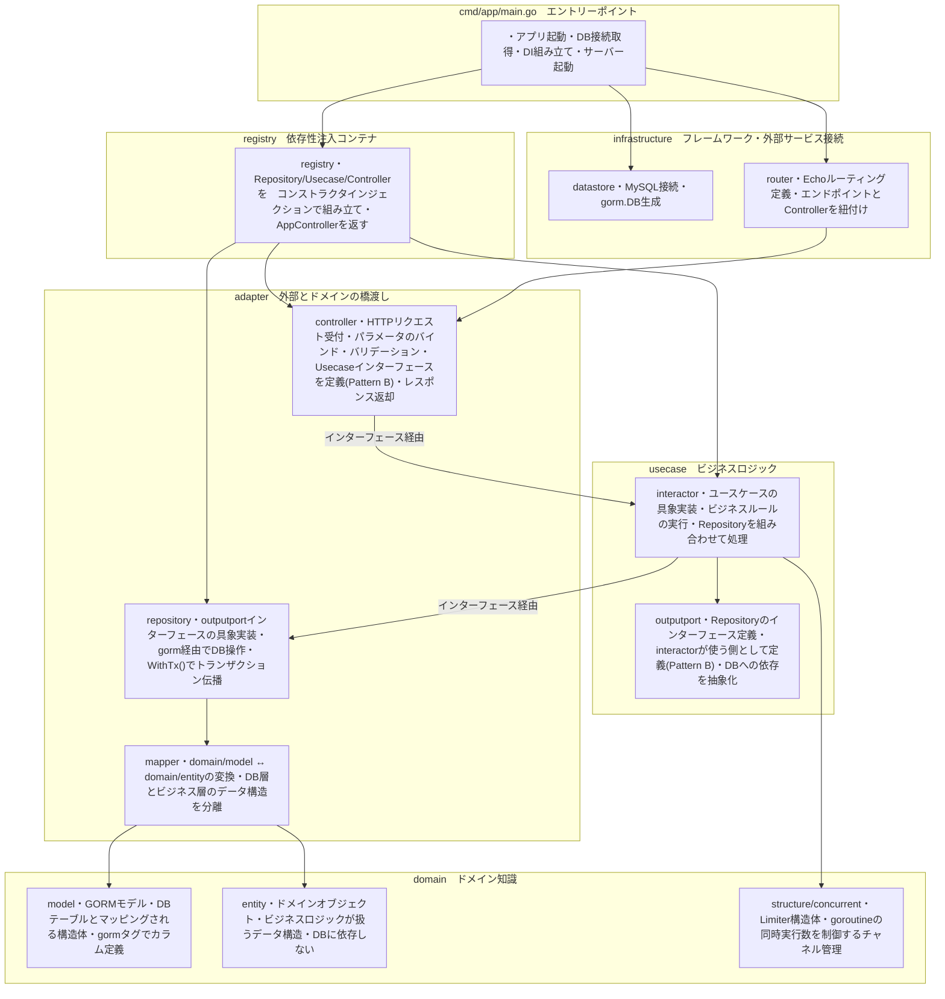
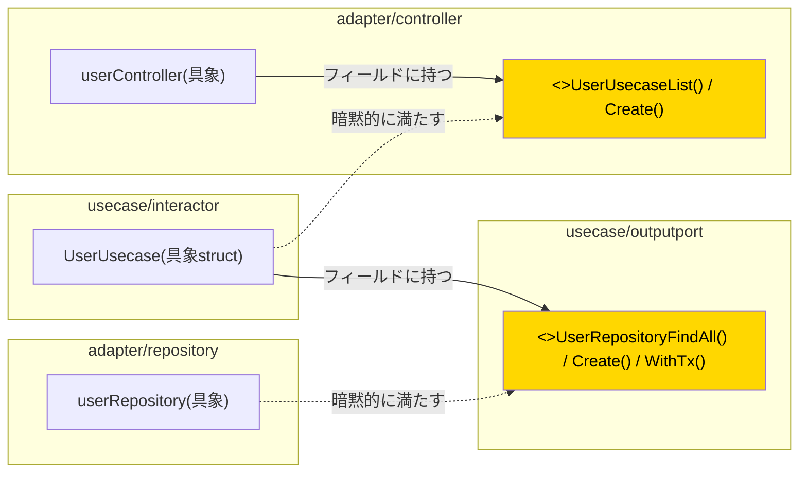
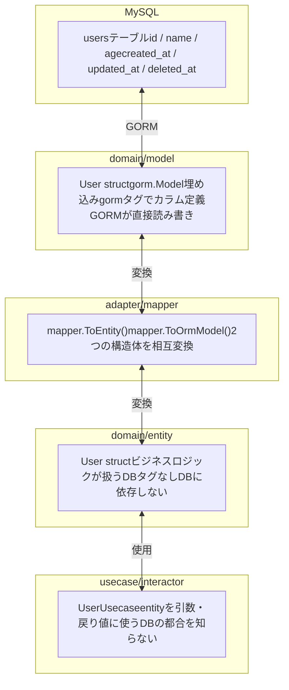
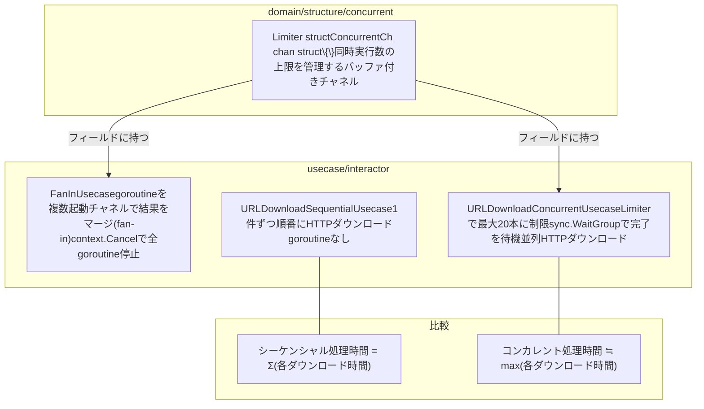
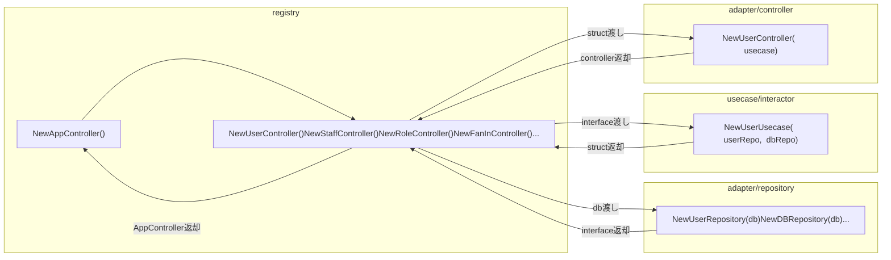

# モジュール役割図

## レイヤー構成と各モジュールの責務

---

## 各レイヤーの役割まとめ

```mermaid
graph LR
    subgraph 外側
        direction TB
        A["infrastructure────────────フレームワーク・DB接続Echo / GORM / MySQL"]
        B["registry────────────依存性注入コンストラクタインジェクション"]
    end

    subgraph 中間
        direction TB
        C["adapter/controller────────────Input PortHTTPリクエスト受付"]
        D["adapter/repository────────────Output Port実装DB操作の具象クラス"]
        E["adapter/mapper────────────データ変換model ↔ entity"]
    end

    subgraph 内側
        direction TB
        F["usecase/interactor────────────ビジネスロジックユースケース実装"]
        G["usecase/outputport────────────Output Port定義Repositoryインターフェース"]
    end

    subgraph 核心
        direction TB
        H["domain/entity────────────ドメインオブジェクトDB非依存"]
        I["domain/model────────────GORMモデルDBマッピング"]
        J["domain/structure────────────goroutine制御Limiter"]
    end

    外側 --> 中間 --> 内側 --> 核心
```

---

## インターフェース(Pattern B)と依存の向き

> **Point**: インターフェースは「使う側」のパッケージに定義する(Pattern B)。
> 具象実装はインターフェースを知らなくてよい。依存の向きが内側に向く。

---

## domain/model と domain/entity の違い

---

## goroutine関連モジュール(fanIn / urlDownloadConcurrent)

---

## registry によるDI組み立てフロー

