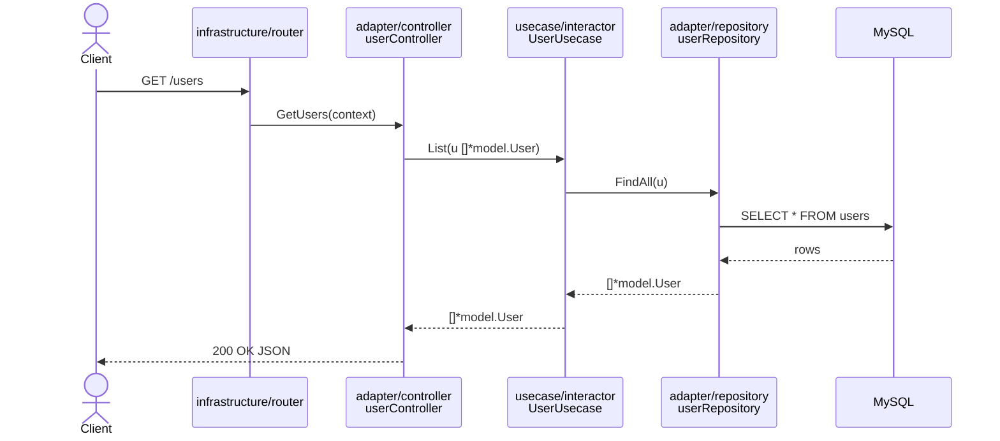
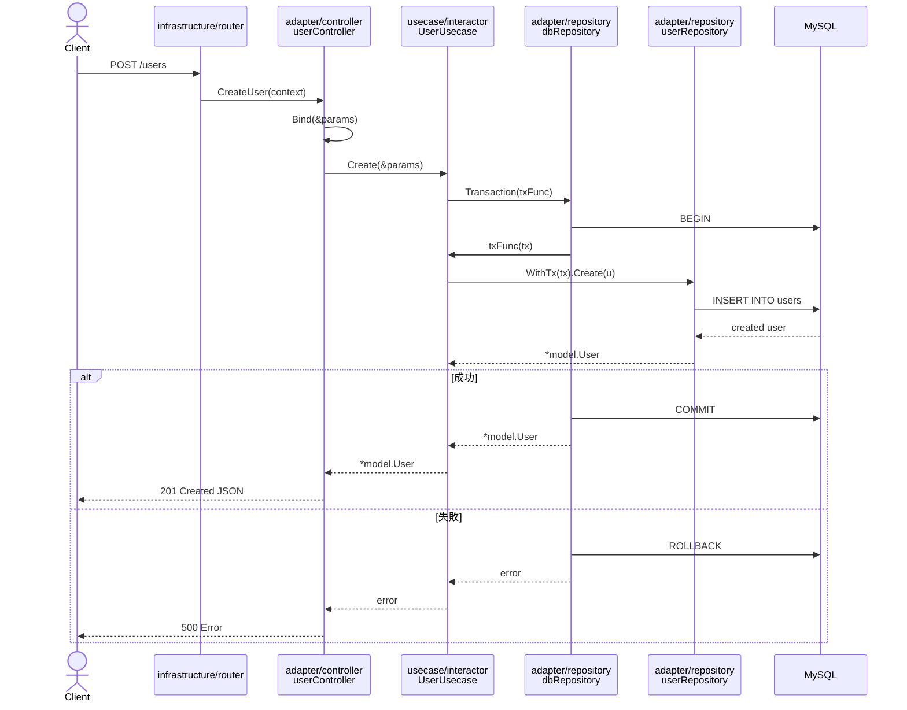
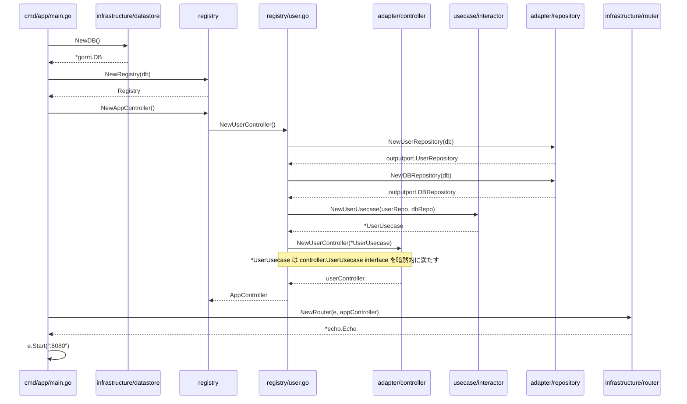
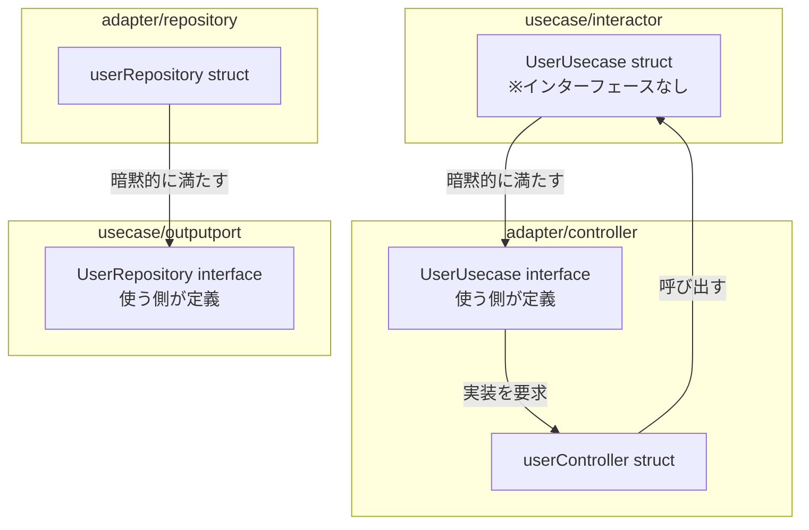

# Clean Architecture シーケンス図

## GET /users

```mermaid
sequenceDiagram
    actor Client
    participant Router as infrastructure/router
    participant Controller as adapter/controller<br>userController
    participant Usecase as usecase/interactor<br>UserUsecase
    participant Repository as adapter/repository<br>userRepository
    participant DB as MySQL

    Client->>Router: GET /users
    Router->>Controller: GetUsers(context)
    Controller->>Usecase: List(u []*model.User)
    Usecase->>Repository: FindAll(u)
    Repository->>DB: SELECT * FROM users
    DB-->>Repository: rows
    Repository-->>Usecase: []*model.User
    Usecase-->>Controller: []*model.User
    Controller-->>Client: 200 OK JSON
```

## POST /users

```mermaid
sequenceDiagram
    actor Client
    participant Router as infrastructure/router
    participant Controller as adapter/controller<br>userController
    participant Usecase as usecase/interactor<br>UserUsecase
    participant DBRepo as adapter/repository<br>dbRepository
    participant UserRepo as adapter/repository<br>userRepository
    participant DB as MySQL

    Client->>Router: POST /users
    Router->>Controller: CreateUser(context)
    Controller->>Controller: Bind(&params)
    Controller->>Usecase: Create(&params)

    Usecase->>DBRepo: Transaction(txFunc)
    DBRepo->>DB: BEGIN
    DBRepo->>Usecase: txFunc(tx)

    Usecase->>UserRepo: WithTx(tx).Create(u)
    UserRepo->>DB: INSERT INTO users
    DB-->>UserRepo: created user
    UserRepo-->>Usecase: *model.User

    alt 成功
        DBRepo->>DB: COMMIT
        DBRepo-->>Usecase: *model.User
        Usecase-->>Controller: *model.User
        Controller-->>Client: 201 Created JSON
    else 失敗
        DBRepo->>DB: ROLLBACK
        DBRepo-->>Usecase: error
        Usecase-->>Controller: error
        Controller-->>Client: 500 Error
    end
```

## 依存性の注入フロー（起動時）

```mermaid
sequenceDiagram
    participant Main as cmd/app/main.go
    participant Datastore as infrastructure/datastore
    participant Registry as registry
    participant R as registry/user.go
    participant Controller as adapter/controller
    participant Interactor as usecase/interactor
    participant Repository as adapter/repository
    participant Router as infrastructure/router

    Main->>Datastore: NewDB()
    Datastore-->>Main: *gorm.DB

    Main->>Registry: NewRegistry(db)
    Registry-->>Main: Registry

    Main->>Registry: NewAppController()
    Registry->>R: NewUserController()
    R->>Repository: NewUserRepository(db)
    Repository-->>R: outputport.UserRepository
    R->>Repository: NewDBRepository(db)
    Repository-->>R: outputport.DBRepository
    R->>Interactor: NewUserUsecase(userRepo, dbRepo)
    Interactor-->>R: *UserUsecase
    R->>Controller: NewUserController(*UserUsecase)
    Note over R,Controller: *UserUsecase は controller.UserUsecase interface を暗黙的に満たす
    Controller-->>R: userController
    R-->>Registry: AppController

    Main->>Router: NewRouter(e, appController)
    Router-->>Main: *echo.Echo

    Main->>Main: e.Start(":8080")
```

## インターフェース定義の配置（Pattern B）

```mermaid
graph TD
    subgraph usecase/interactor
        US["UserUsecase struct<br>※インターフェースなし"]
    end

    subgraph adapter/controller
        UI["UserUsecase interface<br>使う側が定義"]
        UC["userController struct"]
        UI -->|実装を要求| UC
    end

    subgraph usecase/outputport
        RI["UserRepository interface<br>使う側が定義"]
    end

    subgraph adapter/repository
        RS["userRepository struct"]
    end

    US -->|暗黙的に満たす| UI
    RS -->|暗黙的に満たす| RI
    UC -->|呼び出す| US
```
